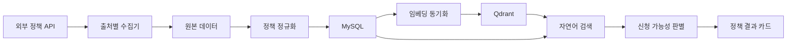

# themoa-policy-search

정책 데이터 수집, MySQL 저장, Qdrant 기반 RAG 검색, 조건 기반 신청 가능성 판별을 제공하는 Spring Boot 애플리케이션입니다.

## 기술 스택

- Java 17, Spring Boot 3.5.16, Gradle Groovy DSL
- Spring MVC, Spring Data JPA, Flyway, Bean Validation, Thymeleaf
- MySQL 8.4, Qdrant 1.14.1
- Spring AI 1.1.8 BOM, Spring AI Qdrant Vector Store
- JUnit 5, Testcontainers, MockWebServer

Spring AI 1.1.8은 Spring 공식 릴리스 공지에서 기준 Spring Boot 버전이 3.5.15로 올라간 버전이다. 이 프로젝트는 같은 3.5 계열의 Spring Boot 3.5.16을 사용한다.

## 전체 아키텍처



MySQL은 정책 데이터의 원본 저장소입니다. Qdrant는 검색용 임베딩 문서와 검색 메타데이터만 보관합니다. Qdrant 장애 또는 `RAG_ENABLED=false` 상태에서는 MySQL 대체 검색으로 동작합니다.

## 환경 설정

`src/main/resources/application-secret.example.yml`을 참고해 `src/main/resources/application-secret.yml`을 만들거나, `.env.example`을 참고해 `.env`를 만듭니다. 실제 키와 비밀번호는 커밋하지 않습니다.

필수/선택 환경변수:

- `MYSQL_HOST`, `MYSQL_PORT`, `MYSQL_DATABASE`, `MYSQL_USERNAME`, `MYSQL_PASSWORD`
- `QDRANT_HOST`, `QDRANT_GRPC_PORT`, `QDRANT_REST_PORT`, `QDRANT_API_KEY`, `QDRANT_COLLECTION_NAME`
- `YOUTH_CENTER_API_KEY`, `GOV_SERVICE_API_KEY`, `LOCAL_WELFARE_API_KEY`, `CENTRAL_WELFARE_API_KEY`
- `RAG_ENABLED`, `OPENAI_API_KEY`, `OPENAI_CHAT_MODEL`, `OPENAI_EMBEDDING_MODEL`
- `ADMIN_API_KEY`

`RAG_ENABLED=false`이면 OpenAI API 키 없이 기동됩니다. `RAG_ENABLED=true`에서는 실제 EmbeddingModel 설정이 필요합니다.

정책 수집은 출처별로 켜고 끌 수 있습니다. 기본값은 `YOUTH_CENTER_COLLECTION_ENABLED=false`,
`GOV_SERVICE_COLLECTION_ENABLED=true`, `LOCAL_WELFARE_COLLECTION_ENABLED=true`,
`CENTRAL_WELFARE_COLLECTION_ENABLED=true`입니다. `POLICY_COLLECTION_PAGE_SIZE`는 한 페이지 요청 크기이고
전체 수집 제한이 아닙니다. 무한 반복 방지용 안전장치는 `POLICY_COLLECTION_MAX_PAGES`입니다.

## 실행

```bash
docker compose up -d
./gradlew bootRun --args='--spring.profiles.active=local'
```

화면:

- 메인 검색: http://localhost:8080/
- 관심 정책: http://localhost:8080/bookmarks
- 캘린더: http://localhost:8080/calendar
- 로컬 개발 확인: http://localhost:8080/dev-console

## 정책 수집

관리자 API는 `X-Admin-Key` 헤더를 사용합니다.

```bash
curl -X POST http://localhost:8080/api/admin/policies/collect \
  -H "X-Admin-Key: $ADMIN_API_KEY"

curl -X POST http://localhost:8080/api/admin/policies/collect/YOUTH_CENTER \
  -H "X-Admin-Key: $ADMIN_API_KEY"

curl -X POST http://localhost:8080/api/admin/policies/reindex \
  -H "X-Admin-Key: $ADMIN_API_KEY"
```

자동 수집은 `app.policy.collection.enabled=true`와 `app.policy.collection.cron`으로 설정합니다. 기본 cron은 Asia/Seoul 기준 매일 03:00입니다.
전체 수집 버튼은 활성화된 출처만 실행하며 비활성 출처는 실패가 아닌 `SKIPPED`로 표시됩니다.
수집 중 한 정책 저장이 실패해도 같은 페이지의 다음 정책과 다음 페이지 처리는 계속됩니다.

임베딩 처리:

```bash
curl -X POST http://localhost:8080/api/admin/policies/embedding/process-pending \
  -H "X-Admin-Key: $ADMIN_API_KEY"

curl -X POST http://localhost:8080/api/admin/policies/embedding/retry-failed \
  -H "X-Admin-Key: $ADMIN_API_KEY"
```

임베딩 처리의 `RAG_EMBEDDING_BATCH_SIZE`는 한 번에 읽는 크기입니다. 전체 처리 제한이 아니며,
`PENDING`이 0건이 될 때까지 반복합니다. `RAG_EMBEDDING_MAX_BATCHES_PER_RUN`은 잘못된 상태로 인한
무한 반복을 막는 안전장치입니다.

## 검색 API

```bash
curl -X POST http://localhost:8080/api/policies/search \
  -H "Content-Type: application/json" \
  -d '{
    "query": "수원 사는 27살 무직 청년이 받을 수 있는 지원금 알려줘",
    "supplementalConditions": {},
    "page": 0,
    "size": 10
  }'
```

상세:

```bash
curl http://localhost:8080/api/policies/1
```

관심 정책:

```bash
curl -X POST http://localhost:8080/api/policies/1/bookmarks -H "X-Member-Id: 1"
curl http://localhost:8080/api/bookmarks -H "X-Member-Id: 1"
curl "http://localhost:8080/api/calendar?from=2026-07-01&to=2026-07-31" -H "X-Member-Id: 1"
```

## RAG 확인 절차

실제로 Qdrant와 OpenAI EmbeddingModel이 연결됐는지는 로컬 개발 확인 화면에서 확인합니다. 검색 화면에 `RAG`라는 글자만 표시되는 것은 검증 기준이 아닙니다.

1. `docker compose up -d`로 MySQL과 Qdrant를 실행합니다.
2. `application-secret.yml`에 `OPENAI_API_KEY`를 입력하고 `RAG_ENABLED: true`로 설정합니다.
3. `./gradlew bootRun --args="--spring.profiles.active=local"`로 실행합니다.
4. `/dev-console`에 접속해 MySQL, Qdrant, OpenAI 설정 여부를 확인합니다.
5. 관리자 키를 입력하고 정책 수집을 실행합니다.
6. `전체 정책 임베딩 대기열 등록`을 누릅니다.
7. `PENDING 임베딩 처리`를 눌러 Qdrant에 문서를 저장합니다.
8. 임베딩 `SYNCED` 건수가 증가했는지 확인합니다.
9. `Qdrant 벡터 검색 확인`에서 `수원 청년 월세 지원` 같은 문장으로 순수 벡터 검색을 실행합니다.
10. 결과에 Qdrant Document ID, policyId, score, metadata, 문서 일부가 표시되면 실제 벡터 검색이 연결된 상태입니다.
11. 일반 검색 화면에서 같은 문장을 검색하고 `검색 방식: Qdrant RAG`, `RAG 호출 여부: 호출함`, `Qdrant 성공 여부: 성공`을 확인합니다.

Qdrant가 중지되거나 `RAG_ENABLED=false`이면 일반 검색은 MySQL fallback으로 동작하며 응답의 `searchMode`는 `MYSQL_FALLBACK`, `degraded`는 `true`가 됩니다. 이 경우 Qdrant 순수 벡터 검색 API는 성공인 척 빈 결과를 반환하지 않고 진단 오류를 반환합니다.

일반 검색은 `RAG_MINIMUM_SIMILARITY` 미만의 Qdrant 후보를 제외합니다. 필터 후 결과가 부족하면
`RAG_SEARCH_RETRY_TOP_K`로 한 번 더 조회하고, 그래도 부족하면 MySQL 조건 검색을 보완 사용합니다.
응답에는 `vectorCandidateCount`, `regionFilteredCount`, `targetFilteredCount`, `finalResultCount`,
`retriedWithLargerTopK`, `mysqlFallbackUsed`가 포함되어 어느 단계에서 제거됐는지 확인할 수 있습니다.

## 개발 콘솔

`/dev-console`은 `local` 프로필에서만 활성화됩니다.

- 시스템 상태: Spring Boot, MySQL, Qdrant, OpenAI 설정 여부, RAG 활성 여부
- 정책 상태: 전체 정책 수, 활성 정책 수
- 임베딩 상태: PENDING, SYNCED, FAILED 건수
- 최근 수집 기록: 출처, 상태, 수신/신규/갱신/제외/실패 건수
- 관리자 작업: 전체 수집, 출처별 수집, 전체 재인덱싱 대기열 등록, PENDING 처리, FAILED 재시도
- 순수 벡터 검색: Qdrant 원본 후보와 score 확인
- local 전용 지역 정리: `/api/dev/repair/central-source-regions`는 관리자 키가 있을 때만 GOV_SERVICE와
  CENTRAL_WELFARE 기존 정책의 지역 관계를 `전국` 기준으로 동기화합니다. DB 전체 삭제가 아니며,
  변경 정책은 재임베딩 PENDING으로 전환됩니다.

관리자 키는 화면 입력란에 직접 넣습니다. HTML이나 JavaScript에 하드코딩하지 않으며 브라우저 `sessionStorage`에만 보관됩니다.

## 화면 테스트

- 자연어 검색: `/`에서 예시 칩을 누르거나 직접 입력합니다.
- 검색 과정 확인: 검색 결과 위 `검색 과정 보기`를 펼쳐 Parser, RAG 호출 여부, 후보 수, fallback 이유를 확인합니다.
- 조건 보완: 부족 조건이 있으면 동적으로 표시되는 입력값을 채우고 다시 검색합니다.
- 관심 정책: 결과 카드 또는 상세 화면에서 저장/해제를 테스트합니다.
- 캘린더: 관심 정책 저장 후 `/calendar`에서 신청 시작/마감 일정을 월간 달력으로 확인합니다.
- 상세: 결과 카드의 상세 보기를 눌러 정책 상세와 공식 링크를 확인합니다.

## 외부 API 주의사항

- data.go.kr 인증키는 이중 URL 인코딩하지 않습니다.
- 행정안전부 공공서비스는 `https://api.odcloud.kr/api/gov24/v3/serviceList`,
  `/serviceDetail`, `/supportConditions`를 JSON으로 사용합니다.
- 지자체복지서비스는 `https://apis.data.go.kr/B554287/LocalGovernmentWelfareInformations`
  아래 `/LcgvWelfarelist`, `/LcgvWelfaredetailed`를 XML로 사용합니다.
- 중앙부처복지서비스는 `https://apis.data.go.kr/B554287/NationalWelfareInformationsV001`
  아래 `/NationalWelfarelistV001`, `/NationalWelfaredetailedV001`를 XML로 사용합니다.
- 필수 필드 누락, XML 파싱 실패, HTTP 오류는 수집 오류 테이블에 기록합니다.
- 기존 DB에 기관명이 지역으로 저장된 경우 `docs/sql/find_invalid_region_codes.sql`로 먼저 영향 범위를
  확인하고, 필요한 경우 `docs/sql/repair_invalid_policy_regions.sql`을 검토해 수동 정리합니다.

## 테스트

```bash
./gradlew clean test
./gradlew bootJar
```

현재 테스트는 실제 API 키 없이 실행됩니다. AI 호출은 운영 검색 경로에서 필수가 아니며, RAG 비활성화 시 규칙 기반 Parser와 MySQL 대체 검색을 사용합니다.

## 장애 해결

MySQL 연결 오류:

- `docker compose ps`로 MySQL 상태를 확인합니다.
- `.env` 또는 `application-secret.yml`의 DB 계정/비밀번호를 확인합니다.
- 기존 실패 마이그레이션이 남았다면 로컬 개발 환경에서만 `docker compose down -v` 후 재시작합니다.

Qdrant 연결 오류:

- REST 6333, gRPC 6334 포트가 열려 있는지 확인합니다.
- `RAG_ENABLED=false`로 대체 검색을 먼저 확인합니다.
- Qdrant 컬렉션명은 `QDRANT_COLLECTION_NAME`으로 통일합니다.

## 구현 범위와 제한사항

- ERD의 전체 테이블은 Flyway V1에 생성됩니다.
- 정책 핵심 테이블, 원본 수집, 수집 로그, 임베딩 동기화, 검색, 상세, 관심 정책, 캘린더 API와 화면을 구현했습니다.
- 금융/카드/고정지출 영역은 이번 범위에서 Flyway 스키마 중심으로 반영했습니다.
- 공식 API 상세 필드 중 공개 HTML에서 보이지 않는 항목은 `docs/ERD_AMBIGUITIES.md`에 기록했고, 수집기는 유연한 파서로 구현했습니다.
